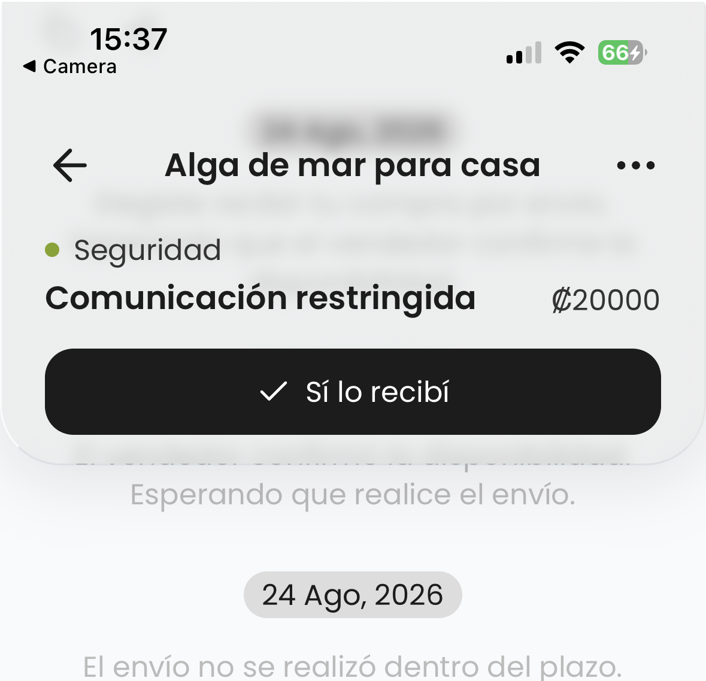
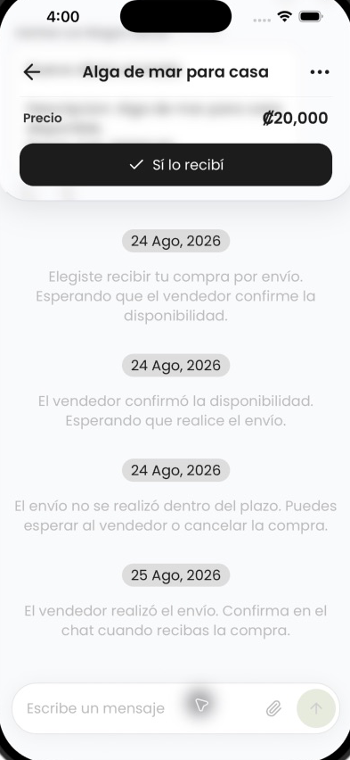
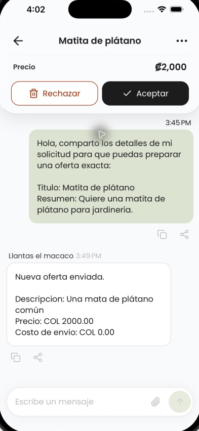
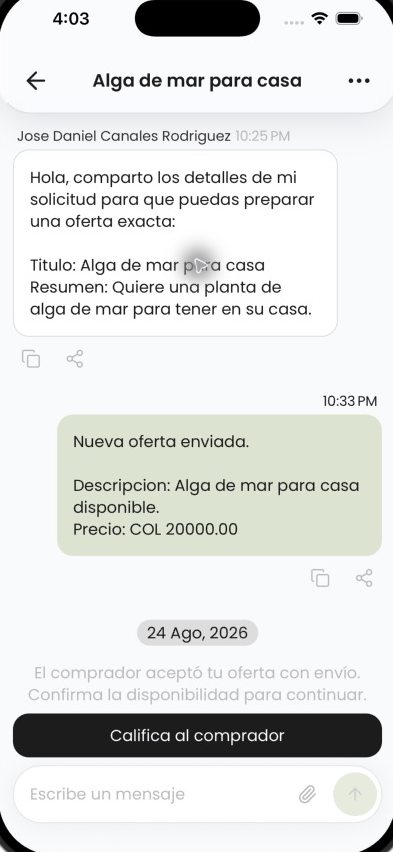

# Conversation upper-action harmony refinement

Date: 2026-08-25

## Audit scope

The conversation header and its DB-driven `TOP` actions on iPhone, with emphasis on the same buyer purchase while communication is unrestricted or safety-restricted. The primary goal is visual continuity without moving lifecycle or safety behavior into client-only logic.

## Evidence

### 1. Buyer, sent shipment, unblocked — before

Health: poor hierarchy. The unlabeled raw amount is larger than the request title and leaves a large, vague gap before the action.

### 2. Buyer, sent shipment, blocked — before

Health: inconsistent. A passive safety `STATUS` slot replaces the price hierarchy in chrome, receives a misleading positive dot, and is duplicated in the thread.

### 3. Buyer, sent shipment, unblocked — after

Health: good. The shelf now has a stable request title, compact labeled price, and one primary action. Amount formatting and hierarchy match nearby offer-card patterns while preserving more chat.

### 4. Buyer, received offer, two actions — after

Health: good. The same offer-context grammar supports destructive and primary actions without changing the information hierarchy.

### 5. Seller, sent shipment — after

Health: good. With no DB `TOP` action, the chrome collapses naturally to the navigation row; the DB `AUX` rating action remains in its existing bottom placement.

## Diagnosis and resolution

- The client was promoting the first generic `STATUS` slot into chrome even though scoped guidance and the DB catalog define `STATUS` as passive thread content.
- Blocking appends a safety `STATUS` slot, so the same purchase changed from an oversized price-only shelf to a safety headline plus small price.
- All `STATUS` slots continue to render in the thread. Chrome now uses only stable offer context plus DB-returned `TOP` actions.
- The amount uses DB `offer_price_amount` and `offer_currency_code`, with the preformatted DB value as fallback. Action labels, icons, tone, ordering, confirmations, executors, filtering, and MENU duplicates are unchanged.
- Safety restriction can still remove the composer and suppress actions through the DB response; the client does not infer blocked state.

## Accessibility checks

- Price context is exposed as one labeled text element with a formatted value.
- Action controls retain explicit button roles, names, disabled/busy state, loading feedback, and at least 44×48 pt targets.
- Price and action rows reflow for narrow widths and larger font scales.
- Screenshot review cannot prove VoiceOver order or maximum Dynamic Type behavior; code inspection covers the intended semantics and reflow path.

## Verification

- Focused ESLint: passed.
- TypeScript (`npx tsc --noEmit`): passed.
- Full project lint: passed.
- Unit tests: 37/37 passed.
- `git diff --check`: passed.

## Evidence limit

The exact blocked purchase was not re-created because doing so would change live safety state. The blocked screenshot supplied by the user establishes the before state, and the new chrome path is independent of `slots`, so adding or removing the DB safety `STATUS` slot no longer changes the upper shelf.
