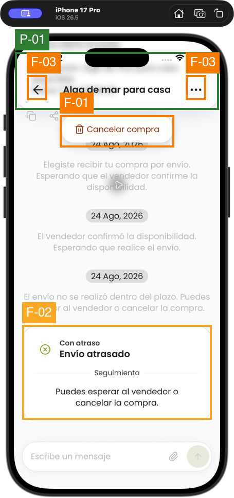
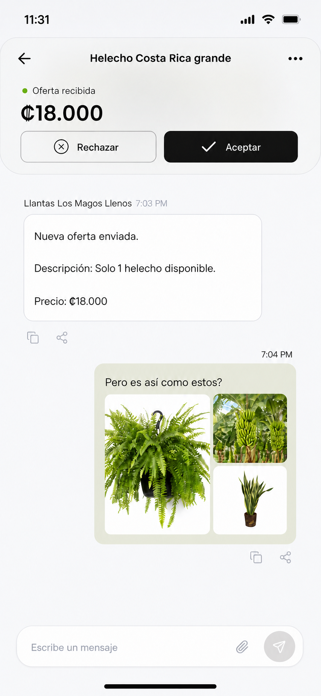
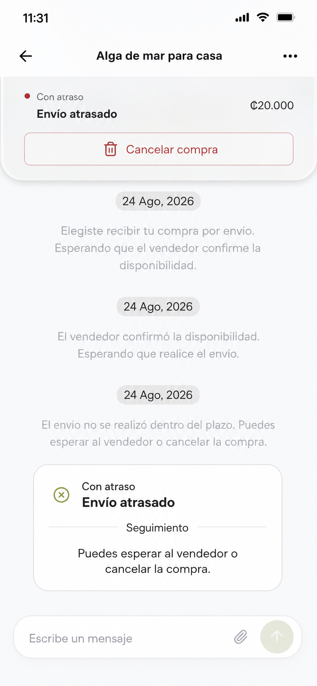

# Conversation upper actions UX/UI audit

Date: 2026-08-25  
Scope: Conversation header plus the offer/status/action area directly beneath it  
Mode: Read-only design analysis; no code, database, or live business state changes

## Executive recommendation

Adopt a **docked glass status shelf**: one continuous, safe-area-attached `chrome` surface containing the existing navigation row and a compact, DB-described offer/status/action section. The lower section appears only when server metadata calls for an upper summary and/or returns `TOP` actions; it collapses completely for terminal states with no upper content.

This resolves the current detachment without adopting the excessive height of the supplied reference. It also creates the missing decision context—role-aware state, amount, and actions—while preserving the database as the lifecycle and action source of truth.

The recommended hierarchy is:

1. Request title: identifies the conversation.
2. Role-aware status eyebrow: explains why the shelf is present, for example “Oferta recibida” or “Oferta enviada”.
3. Amount or compact state headline: the decision object.
4. DB-returned `TOP` actions: black semantic primary; quiet outline secondary/destructive.
5. Conversation content: starts immediately below the single glass silhouette.

## Evidence and inspection coverage

### Directly inspected in the running iPhone simulator

1. Buyer · `OFFER_REJECTED` · “Helecho grande”: terminal header-only state and conversation history.
2. Buyer · `OFFER_REJECTED` · overflow menu: “Centro de ayuda” and “Mostrar negocio”.
3. Buyer · `DELAYED_ACCEPTANCE` · “Alga de mar para casa”: floating `TOP` action “Cancelar compra”, passive “Con atraso / Envío atrasado” status card in the thread, composer present.
4. Buyer · `DELAYED_ACCEPTANCE` · destructive confirmation: opened read-only, then dismissed with “Volver”; the confirm action was not submitted.
5. Buyer · `FINALIZED`: header-only upper area and black bottom `AUX` action “Califica al vendedor”.
6. Seller · `OFFER_REJECTED`: terminal header-only state.
7. Seller · `FINALIZED`: header-only upper area and black bottom `AUX` action “Califica al comprador”.
8. Seller · `DELAYED_ACCEPTANCE`: header-only upper area, passive delayed status in the thread, and black bottom `AUX` action “Finalizar”.
9. Buyer · `DELAYED_ACCEPTANCE` overflow: the same “Cancelar compra” action was present in both `TOP` and `MENU`, followed by help/business actions.

Buyer and seller profile switching was used only to inspect existing data. No offer was accepted, rejected, cancelled, discarded, finalized, or otherwise transitioned.

### Reference- and metadata-backed coverage

No live `OFFER_MADE` conversation existed in the signed-in dataset. The received-offer assessment therefore combines the supplied reference image with the current implementation and the database action/status catalog. This is explicitly not presented as a simulator-observed pending offer.

The current database catalog defines 12 statuses: `REQUEST_OPENED`, `REQUEST_DISCARDED`, `OFFER_MADE`, `OFFER_ACCEPTED`, `SELLER_ACCEPTED`, `SENT_SHIPMENT`, `DELAYED_ACCEPTANCE`, `DELAYED_SHIPMENT`, `FINALIZED`, `OFFER_REJECTED`, `REQUEST_CANCELED`, and `PARTICIPANT_DELETED`. There is no generic `EXPIRED` status: deadline expiry moves conversations into delayed states. Evidence: `../luppit-supabase/supabase/seed.sql:863` and `:886`.

### Evidence files

- [01 buyer rejected](assets/01-buyer-rejected.png)
- [02 buyer rejected menu](assets/02-buyer-rejected-menu.png)
- [03 buyer delayed action](assets/03-buyer-delayed-cancel-action.png)
- [03 annotated](assets/03-buyer-delayed-cancel-action-annotated.png)
- [04 confirmation](assets/04-cancel-confirmation.png)
- [04 annotated](assets/04-cancel-confirmation-annotated.png)
- [05 buyer completed](assets/05-buyer-completed-rating-bottom.png)
- [05 annotated](assets/05-buyer-completed-rating-bottom-annotated.png)
- [06 seller rejected](assets/06-seller-rejected.png)
- [07 seller completed](assets/07-seller-completed-rating-bottom.png)

## General health

The underlying behavior is coherent and strongly metadata-driven: `TOP`, `AUX`, `MENU`, and passive `STATUS` slots are distinct, terminal states remove time-sensitive top actions, and destructive actions receive confirmation. The problem is primarily presentation and interaction semantics, not lifecycle logic.

The existing attached glass header is directionally correct. The top action renderer is a second, opaque, independently shadowed object that contains no status or monetary context. This makes the action feel like a floating overlay rather than part of either navigation or the conversation. The supplied reference corrects the missing hierarchy but grows into a large stacked plate that consumes too much of the initial conversation viewport.

## Annotated findings

### Positive patterns

| ID | Evidence | Assessment |
|---|---|---|
| P-01 | Delayed buyer state | The safe-area-attached header uses the shared `chrome` glass role and rounds only its lower corners. This aligns with the current Luppit glass direction. |
| P-02 | Confirmation sheet | Destructive confirmation copy is clear, explicitly irreversible, and offers a safe “Volver” route. The bottom sheet reads as a system-like decision layer. |
| P-03 | Buyer finalized | Terminal state removes the upper action surface, preserving chat space; rating is correctly treated as a bottom `AUX` task. |
| P-04 | Seller rejected/finalized | Seller terminal states follow the same structural behavior, while role-specific rating copy changes appropriately. |

### Functional issues

| ID | Severity | Finding | Evidence | Recommendation |
|---|---:|---|---|---|
| F-01 | 3 · major | `TOP` actions lack the offer/status object they act on. In the live delayed buyer state, “Cancelar compra” floats by itself; in pending-offer states the current component can render Reject/Accept but has no price or role-aware label. This is a high-consequence context gap. | Live screen 03; `ConversationActionButtons.tsx:50`; current `TOP` composition in `_layout.tsx:1215` | Put role-aware status and amount in the same docked shelf as the DB-returned actions. Have the RPC describe summary presentation; do not map lifecycle codes in the client. |
| F-02 | 2 · moderate | Action and reason are spatially split. The fixed destructive action is at the top while the passive delayed-status card is deep in the scrolling thread. Users must visually connect two distant objects. | Live screen 03; status cards render after messages in `chat.tsx:603` | Keep detailed passive status in the thread, but echo its compact server-provided state label in the upper shelf when a `TOP` action depends on it. |
| F-03 | 3 · major | Header and top-action accessibility semantics are incomplete. The runtime accessibility tree exposed generic unlabeled controls for back/overflow and inconsistent “link”/“image” semantics for the top action. Source confirms no explicit role/label/hint/state on these controls. | Live accessibility inspection; `_layout.tsx:1183`, `:1196`; `ConversationActionButtons.tsx:68` | Add explicit button roles, labels, hints where useful, disabled/busy states, and deterministic reading order. |
| F-04 | 3 · major | The action executor prevents concurrent work internally, but the top-action component receives no disabled/loading state. Users get no immediate in-control feedback and may retry a consequential action. | `_layout.tsx:1229`; `ConversationActionButtons.tsx:20` | Disable every action surface for the active operation, show an in-button progress indicator, preserve the label, and announce success/error. |

### Usability risks

| ID | Severity | Finding | Evidence | Recommendation |
|---|---:|---|---|---|
| F-05 | 2 · moderate | The top layout assumes a fixed 64-point action-overlay allowance even though text and controls scale. The shared text wrapper caps scaling at 1.3 and the title is fixed to one line. This risks truncation or overlap at larger accessibility sizes. | `_layout.tsx:1112`, `:1191`; `Text.tsx:17` | Measure the actual composed chrome height. Support large Dynamic Type, two-line/leading title fallback, and vertically stacked actions when needed. |
| F-06 | 2 · moderate | The action pill is an opaque white surface with a custom shadow, radius, clipping, and divider recipe. It sits directly below a shared glass header, producing two material systems and a visible “detached plate” effect. | Live screen 03; `conversation/styles.ts:16` | Use one `GlassSurface` chrome silhouette. Controls inside it should be visually plainer than the parent; remove the second heavy shadow. |
| F-07 | 3 · major if adopting the reference | The supplied reference makes the offer hierarchy clear but the upper stack is too tall: it behaves like a second screen header and reduces the amount of immediately visible conversation. | Supplied reference image | Keep the summary to one eyebrow row, one amount/headline row, and one action row. Avoid a separate large card nested under the header. |
| F-08 | 2 · moderate | Some consequential actions are deliberately present in both `TOP` and `MENU`; “Cancelar compra” was observed in both locations. Repetition can make the overflow feel like a competing action surface. | Live delayed-buyer menu; seed action pairs at `seed.sql:1452–1468` | Never client-dedupe. If product wants less repetition, change the DB slot authoring policy. If a duplicate remains intentional, keep label, icon, confirmation, disabled, and loading behavior identical. |

### Optional polish

- Use restrained green only as a small status dot/positive semantic accent. Do not fill the primary decision button green; use the established black action.
- On white chat content, use the regular/legible chrome material with a fine neutral border and one soft shadow. A very clear material will disappear against the white background.
- Animate only height/opacity during server-confirmed state refresh. Avoid springy floating-card motion for financial or fulfillment decisions.
- Preserve the current calm white conversation surface and soft system cards; do not glassify message content.

Apple’s current guidance positions Liquid Glass as a functional layer for controls/navigation above content, recommends using it sparingly, and advises more legible variants when text sits on the material. It also says custom controls need clear pressed feedback and at least a 44×44 pt hit region. See [Materials](https://developer.apple.com/design/human-interface-guidelines/materials), [Buttons](https://developer.apple.com/design/human-interface-guidelines/buttons), and [Layout](https://developer.apple.com/design/human-interface-guidelines/layout).

## Viable layout directions

| Direction | Structure | Advantages | Tradeoffs |
|---|---|---|---|
| A. Docked glass status shelf · **recommended** | One top-attached `chrome` surface: navigation row, compact summary, actions. One continuous bottom radius and shadow. | Best action context; strongest hierarchy; native-feeling control layer; persistent and discoverable; resolves detachment. | Costs more vertical space than header-only; requires measured height and DB-described summary metadata. |
| B. Inline status card | Keep the glass header; render a `surface` material card as the first item in the thread. It scrolls with messages. | Maximizes the resting chat viewport; status feels like conversation history; simpler sticky behavior. | Primary actions can scroll out of view; weak discoverability for time-sensitive decisions; should use a standard surface material rather than navigation Liquid Glass. |
| C. Compact floating action rail | Keep header and a small `control`-role capsule below it, adding a short status/amount line. | Smallest change from the current UI; minimal vertical cost; works well for a single action. | Remains visually detached; cramped with two actions, long Spanish labels, or Dynamic Type; duplicate shadows and content overlap remain easy to reintroduce. |

Direction A is the only option that reliably joins identity, decision context, and action without turning the offer into a large independent card.

## Recommended visual and behavior specification

### Geometry and material

- One `GlassSurface` using the shared `chrome` role, attached to top and side safe-area edges.
- Top corners remain square/attached; only the two bottom corners are rounded.
- One clip mask, one border, and one shadow for the entire silhouette.
- Navigation row remains approximately 56 pt high after safe area.
- Optional lower shelf uses 12–16 pt internal spacing, a compact eyebrow/headline stack, and 48 pt actions.
- The action row sits 12 pt below the amount/headline. Two actions are equal width. A single action is full width.
- No nested glass cards or secondary floating shadow. Buttons inside the glass are solid/outline controls.
- Chat content begins from the measured lower edge of the surface, not a fixed guessed inset.

### Hierarchy

- Title stays the request title, not the business or counterparty name.
- Eyebrow is server-provided and role-aware: for example “Oferta recibida” for a buyer and “Oferta enviada” for a seller.
- Amount uses the RPC’s formatted offer price. If no offer exists, use a compact server-provided state headline instead; do not display a fake zero or empty amount row.
- Primary action is black. Secondary/destructive is a quiet outline with semantic red text/icon. Green is reserved for a small positive status dot or confirmed state accent.
- Status meaning never relies on color alone; pair color with text and, when useful, an icon.

### Visibility and scroll

- Header is always sticky.
- Lower shelf visibility is DB-driven. Render it when the conversation view provides upper-summary metadata and/or `TOP` actions. Do not hardcode status-code conditions in the client.
- When present, the lower shelf remains sticky with the header until a refreshed conversation view removes or changes it. Do not auto-collapse it on scroll; high-consequence actions should not vanish while the user is reading context.
- Passive `STATUS` cards remain in the scroll flow and can carry the longer explanation/deadline.
- `AUX` remains at the bottom/composer boundary exactly as returned by the DB.
- Terminal states with no upper summary or `TOP` action collapse immediately to header-only, preserving the successful live behavior.

### Action states

1. Rest: all DB-returned actions visible in slot order; no client dedupe.
2. Pressed: immediate opacity/scale or fill feedback that remains legible.
3. Confirmation required: use the existing DB-defined confirmation sheet.
4. Executing: disable all copies of the action in `TOP`, `AUX`, and `MENU`; show progress in the activated surface; prevent double submission.
5. Success: refresh `get_conversation_view`, animate shelf height/content to the server-confirmed result, and announce the new status.
6. Stale state/conflict: keep the conversation open, explain that the offer changed, refresh metadata, and place focus on the updated summary.
7. Network failure: keep the original state/actions, show a concise error, restore controls, and provide retry without optimistic lifecycle text.

### Accessibility

- Back: `button`, label “Volver”, minimum 44×44 pt hit region.
- Overflow: `button`, label “Más acciones”, expanded state while the menu is open.
- Every action: explicit `button` role, DB label, optional consequence hint, disabled/busy state, and visible pressed state.
- VoiceOver order: title → role-aware status → amount/headline → actions → first visible conversation item.
- After a state refresh, announce the server-returned status politely; do not steal focus unless the current action becomes invalid.
- Support at least the platform’s large accessibility text categories; Apple recommends interfaces remain usable with text enlarged substantially, ideally up to 200%. See [Accessibility](https://developer.apple.com/design/human-interface-guidelines/accessibility) and [Typography](https://developer.apple.com/design/human-interface-guidelines/typography).
- At large text sizes: title may become two lines and leading-aligned; action labels may wrap; two actions stack vertically; no text is clipped or shrunk to fit.
- Respect Increase Contrast and Reduce Transparency with a more opaque semantic fallback while retaining the same hierarchy.

## State-by-state product specification

This table describes desired presentation outcomes. The RPC/DB metadata—not client lifecycle branches—must decide the summary text, visibility, slots, ordering, confirmation, and executable action set.

| Status | Buyer upper behavior | Seller upper behavior |
|---|---|---|
| `REQUEST_OPENED` | Header-only unless the RPC explicitly supplies an upper summary/action. | “Solicitud abierta”; no amount; `TOP` actions currently `Descartar` and `Ofertar`. Black `Ofertar`, outlined destructive `Descartar`. |
| `REQUEST_DISCARDED` | Header-only terminal presentation. | Header-only terminal presentation. |
| `OFFER_MADE` | “Oferta recibida” + formatted price; `Rechazar` outline and `Aceptar` black, in DB order. | “Oferta enviada” + formatted price; render current DB `TOP` actions only. Seed enables `Cancelar`; `Modificar` remains absent while disabled in metadata. |
| `OFFER_ACCEPTED` | Compact server-described accepted summary if configured; no invented upper action. Preserve DB `AUX`/`MENU` placement. | “Oferta aceptada” + price; current `TOP` actions `Descartar` and `Concretar`, with `Concretar` black. |
| `SELLER_ACCEPTED` | “Venta confirmada” summary; render conditional pickup-code `TOP` action only when returned by RPC. | Compact summary if configured; `Finalizar` stays `AUX`, not moved into the upper shelf. |
| `SENT_SHIPMENT` | “Envío realizado” + price/supporting fulfillment context; current two `TOP` receipt actions remain visible and equal width. Positive confirmation is black; negative is outline. | Summary-only if configured; preserve seller `AUX` behavior from metadata. |
| `DELAYED_ACCEPTANCE` | “Con atraso / Confirmación atrasada” + price; full-width outlined destructive `Cancelar compra` when returned as `TOP`. | Summary-only if configured; `Finalizar` remains black `AUX`. |
| `DELAYED_SHIPMENT` | “Con atraso / Entrega atrasada” + price; current two `TOP` receipt actions remain visible. | Summary-only if configured; preserve current metadata-driven `AUX`/menu behavior. |
| `FINALIZED` | Collapse to header-only; preserve black `AUX` rating action when returned. | Collapse to header-only; preserve black `AUX` rating action when returned. |
| `OFFER_REJECTED` | Header-only terminal presentation; keep status in history/passive content and safety/menu actions. | Header-only terminal presentation. |
| `REQUEST_CANCELED` | Header-only terminal presentation. | Header-only terminal presentation. |
| `PARTICIPANT_DELETED` | Header-only terminal/unavailable presentation according to RPC. | Same. |

If the database ever returns more than two `TOP` actions, the renderer must not drop or re-slot them. Wrap additional actions into subsequent full-width rows, or change slot authoring in the DB.

## Recommended mockups

### Received offer

The amount and decision live in the same functional glass layer as the conversation identity. The shelf is notably shorter than the supplied reference and uses a black primary action with restrained green only in the status cue.

### Delayed single-action state

This variation shows how the same structure handles a single destructive action without leaving a detached floating pill. The longer lifecycle explanation remains in the thread.

Mockups were created with the built-in Imagegen workflow, grounded in the supplied reference and the live Luppit simulator captures. They are visual specifications, not implementation screenshots.

## Source observations supporting the diagnosis

- `app/(conversation)/_layout.tsx:1089–1115` separates actions by DB slot but reserves a fixed top action height.
- `app/(conversation)/_layout.tsx:1145–1213` correctly uses shared `GlassSurface` `chrome` for the attached header.
- `app/(conversation)/_layout.tsx:1215–1239` positions the action component as a separate absolute overlay.
- `src/components/conversation/ConversationActionButtons.tsx:50–90` renders only buttons, with no summary, explicit accessibility semantics, disabled state, or progress state.
- `src/components/conversation/styles.ts:16–44` creates the opaque white/custom-shadow material drift.
- `app/(conversation)/chat.tsx:574–605` keeps passive status slots in the conversation scroll flow.
- `src/components/Text.tsx:12–35` allows scaling but caps it at 1.3 by default.
- `../luppit-supabase/supabase/seed.sql:1450–1560` confirms DB-owned slots, labels, styles, role/state enablement, and intentional `TOP`/`MENU` duplication.

## Validation and limitations

- All simulator work was read-only except navigation, profile switching, opening menus, and opening/dismissing a confirmation sheet.
- No destructive confirmation was submitted.
- No database rows, source files, configuration, or application implementation were modified for this audit.
- Static screenshots cannot validate actual Dynamic Type reflow, Reduce Transparency, Increase Contrast, VoiceOver focus movement, pressed animation, loading latency, or stale-state recovery. Those items are source-backed risks/specifications and require implementation-stage testing.
- Pending received/sent offers were not present in the live data; their layouts are reference- and DB-backed.

