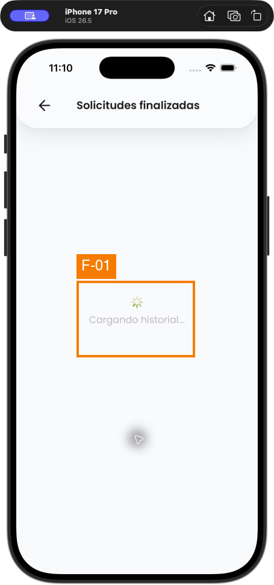
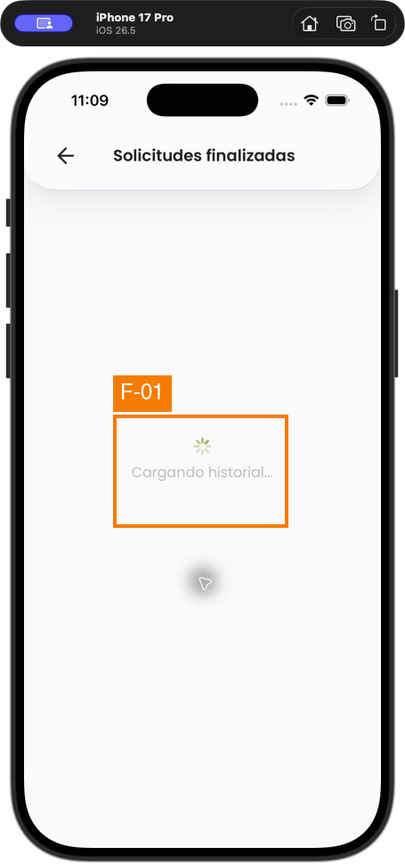
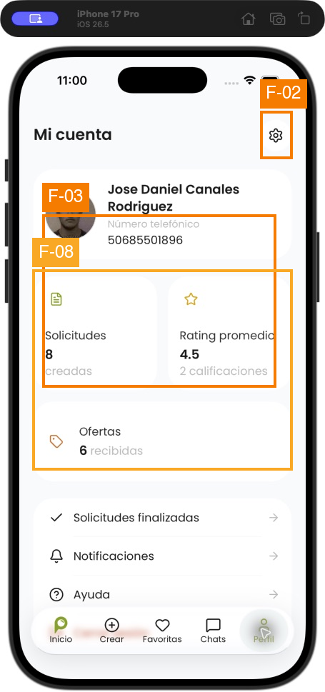
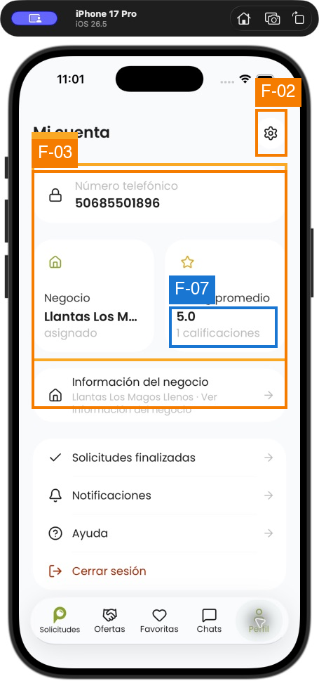
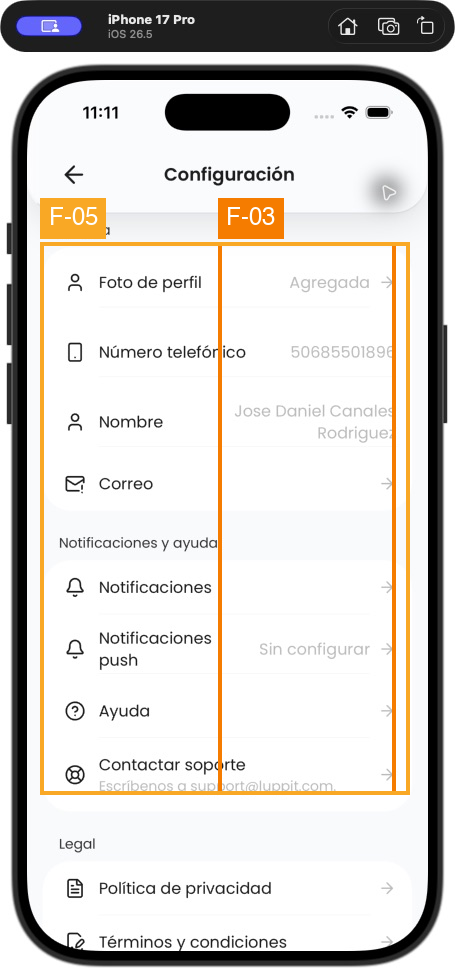
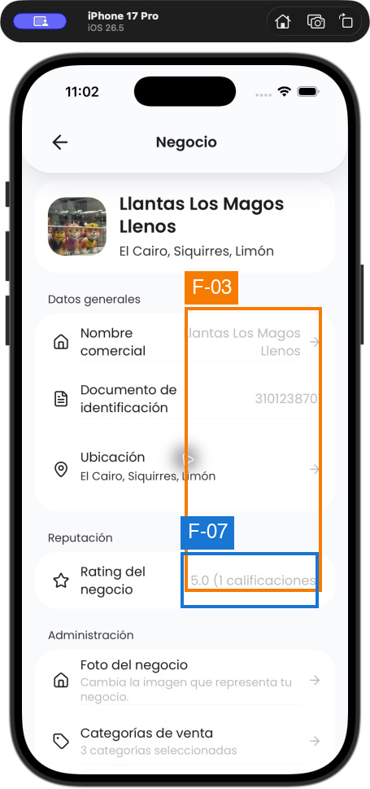
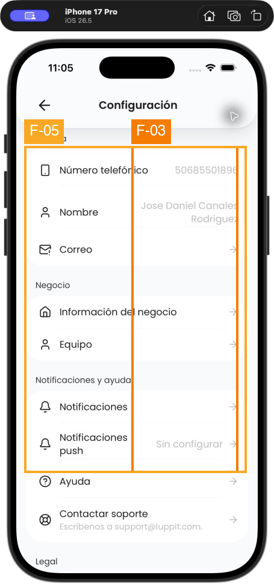
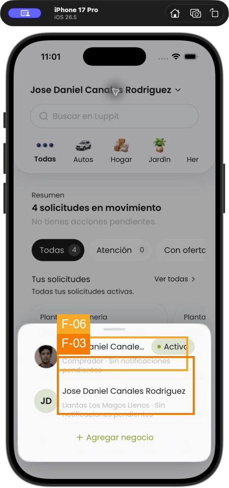
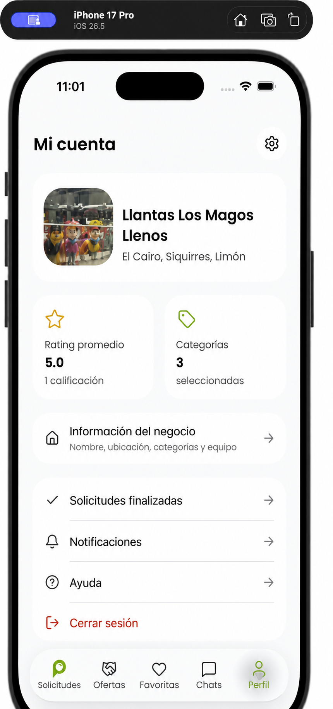

# UX/UI Audit — Luppit Profile and Settings

## Executive summary

The underlying direction is sound: both roles use native-feeling navigation, restrained glass for chrome, and calm soft grouped lists for account content. Settings parity is strong, and the business-editing, help, empty, and destructive-confirmation states are generally clear enough to keep. The highest-priority problems are shared rather than role-specific: completed-request history never resolves beyond `Cargando historial…`, the profile gear is unnamed to assistive technology, and the pale secondary-text token produces measured contrast below WCAG guidance on the surfaces where it is used.

Only the seller main Profile materially needs a visual redesign. Its phone-first hierarchy hides the business identity and truncates the business name inside a metric card; the buyer profile already has the stronger identity-first pattern. The rest should be improved through targeted state handling, shared component semantics, contrast-token changes, copy fixes, and flexible text layout—not a broad re-theme or new flow.

## Audit scope and method

- **Goal evaluated:** Let a signed-in buyer or seller understand their active identity, reach account and business controls, review account state, get help, and safely perform account actions.
- **Accessibility target:** A coherent iOS experience with readable normal text, meaningful control names and values, logical reading order, comfortable touch targets, and support for text enlargement.
- **Device inspected:** iPhone 17 Pro simulator, iOS 26.5, current local working tree, signed-in live state.
- **Method:** Direct simulator walkthrough using the in-app buyer/seller switcher; stable screenshots; simulator accessibility-tree inspection; relevant React Native component and token review; comparison against repository UI guidance, Apple HIG, Nielsen heuristics, Gestalt grouping, Norman signifiers, WCAG 2.1 static criteria, and content-design heuristics.
- **Product constraints preserved:** Current DB-driven profile roles and fields, existing navigation, shared `GlassSurface`, shared `GroupedList`, restrained green accent, and existing product behavior.
- **External effects deliberately avoided:** The final `Verificar teléfono` actions were not pressed because they would initiate OTP/account-deletion workflows. No account or profile was deleted.

## Screens and states inspected

### Buyer (Comprador)

| Step | State | Evidence | Health |
|---:|---|---|---|
| 1 | Main Profile: identity, metrics, actions, bottom navigation | [01](assets/01-buyer-profile.png) | Good structure; shared accessibility/contrast issues |
| 2 | Settings: account, notification/help, legal, security, sign out, delete | [23](assets/23-buyer-settings-top.png), [27](assets/27-buyer-settings-lower.png) | Good IA; shared semantics/contrast issues |
| 3 | Profile photo edit | [24](assets/24-buyer-profile-photo-edit.png) | Keep |
| 4 | Email edit/verification preparation | [25](assets/25-buyer-email-settings.png) | Keep |
| 5 | Notifications empty state | [03](assets/03-buyer-notifications-empty.png) | Keep |
| 6 | Completed requests loading | [22](assets/22-buyer-completed-requests.png) | Blocked; no terminal state |
| 7 | Profile switcher with buyer active | [04](assets/04-profile-switcher-buyer-active.png) | Works; active title clips |

### Seller (Vendedor)

| Step | State | Evidence | Health |
|---:|---|---|---|
| 8 | Main Profile: phone, business metric, rating, actions | [05](assets/05-seller-profile.png) | Material hierarchy redesign recommended |
| 9 | Business profile overview | [06](assets/06-seller-business-profile.png) | Keep; shared contrast/copy fixes |
| 10 | Business category selection and unchanged disabled-save state | [07](assets/07-seller-business-categories.png) | Keep |
| 11 | Business location hierarchy (province/canton/district) | [08](assets/08-seller-business-location.png) | Keep |
| 12 | Business-name edit | [09](assets/09-seller-business-name-edit.png) | Keep; verify unchanged-save behavior |
| 13 | Team/ownership state | [10](assets/10-seller-team.png) | Keep |
| 14 | Settings: account, business, notification/help, legal, security, sign out, profile/account delete | [11](assets/11-seller-settings-top.png), [12](assets/12-seller-settings-lower.png) | Good role-specific extension; shared semantics/contrast issues |
| 15 | Email edit/verification preparation | [13](assets/13-seller-email-settings.png) | Keep |
| 16 | Completed requests loading | [20](assets/20-seller-completed-requests-loading.png) | Blocked; no terminal state |
| 17 | Profile switcher with seller active | [21](assets/21-profile-switcher-seller-active.png) | Works; active title clips |
| 18 | Delete seller profile confirmation | [15](assets/15-delete-seller-profile-confirmation.png) | Keep |

### Shared destinations and overlays

| Step | State | Evidence | Health |
|---:|---|---|---|
| 19 | Sign-out confirmation | [14](assets/14-signout-confirmation.png) | Keep |
| 20 | Delete entire account confirmation | [16](assets/16-delete-account-confirmation.png) | Keep |
| 21 | Blocked accounts empty state | [17](assets/17-blocked-accounts-empty.png) | Keep |
| 22 | Help/FAQ collapsed | [18](assets/18-help-faq.png) | Keep |
| 23 | Help/FAQ expanded | [19](assets/19-help-faq-expanded.png) | Keep |
| 24 | Privacy policy | [26](assets/26-privacy-policy.png) | Keep |

The 26 captured screenshots include alternate scroll positions and role variants of these 24 material states.

## Findings overview

| ID | Sev | Scope | Finding | Heuristics / criteria |
|---|---:|---|---|---|
| F-01 | 3 Major | Both roles | Completed requests stays indefinitely on `Cargando historial…` with no success, empty, timeout, error, or retry state | Nielsen 1, 9; Shneiderman informative feedback; state completeness |
| F-02 | 3 Major | Both main profiles | The gear is exposed only as an unnamed `button`, so VoiceOver does not identify Settings | WCAG 4.1.2; Norman signifiers; Apple accessibility labels |
| F-03 | 3 Major | Shared surfaces | Secondary text is too pale: `#BBBBBB` measures 1.92:1 on white and 1.84:1 on `#F9FAFB`; small green text is 2.91:1 on white | WCAG 1.4.3; perceptibility; HIG legibility |
| F-04 | 2 Minor | Seller main Profile | Phone-first hierarchy suppresses the seller's business identity, while the business name is truncated inside a metric card | Nielsen 2, 6, 8; Gestalt common region; content hierarchy |
| F-05 | 2 Minor | Settings/shared rows | Interactive grouped rows announce the label but omit visible values/descriptions such as `Agregada` and `Sin configurar` | WCAG 1.3.1, 4.1.2; Nielsen 1, 6 |
| F-06 | 2 Minor | Profile switcher | The active profile name clips when the `Activo` chip competes for the same line, weakening comparison between same-name profiles | Nielsen 4, 6; HIG typography/layout |
| F-08 | 2 Minor | Buyer main Profile | Accessibility reading order crosses metric cards: both labels are read before both values instead of each card as one unit | WCAG 1.3.1; Gestalt common region; Gerhardt-Powals grouping |
| F-07 | 1 Cosmetic | Seller Profile/business | Singular rating copy reads `1 calificaciones` | Content-design grammar and clarity |

## Detailed findings

### [S3] F-01 — Completed history never reaches a terminal state

- **Evidence:** Buyer and seller both remained on the same centered spinner and `Cargando historial…` copy through repeated inspections and an additional timed wait. No timeout, empty result, error explanation, backoff, or retry action appeared.
- **Impact:** The history task is impossible to finish and gives no basis for deciding whether to wait, retry, or leave.
- **Recommendation:** Resolve the underlying request path first. Give the screen mutually exclusive loading, loaded, empty, and recoverable-error states; after a bounded wait, replace the spinner with concise failure copy and `Reintentar`. Preserve the existing top bar and list language.
- **Effort:** M; likely service/state handling rather than visual redesign.

### [S3] F-02 — Settings entry has no accessible name

- **Evidence:** In both roles, simulator accessibility inspection reports the top-right control as `button` with no descriptive name. The visual gear is familiar to sighted users, but the icon alone does not supply an assistive-technology label.
- **Impact:** VoiceOver users can encounter an unexplained button at the primary entry to account settings.
- **Recommendation:** Give the shared gear control the accessible label `Configuración`; keep its current 44 × 44 pt hit area and visual treatment.
- **Effort:** S.

### [S3] F-03 — Secondary text and small green labels do not have enough contrast

- **Evidence:** The shared muted token is visibly used for phone labels, current values, descriptions, ratings, and state copy. Palette calculation yields `#BBBBBB` at 1.92:1 against white and 1.84:1 against `#F9FAFB`; the accent `#83A31E` yields 2.91:1 against white. These are below the 4.5:1 reference for ordinary text. Material compositing can alter individual pixels, so the exact rendered contrast should also be spot-checked on device.
- **Impact:** Essential current-state information looks disabled and may be unreadable to users with low vision or in glare.
- **Recommendation:** Introduce/use a darker semantic secondary-text token that reaches at least 4.5:1 on the actual soft-list surfaces. Keep the bright green for icons, selected indicators, and larger non-text accents; use a darker green variant for small text links/chips on white.
- **Effort:** S–M, shared token change plus visual regression pass.

### [S2] F-04 — Seller profile does not lead with the seller identity

- **Evidence:** The dominant card shows only the login phone number. The business—the identity that determines the seller's role, reputation, and navigation—is reduced to a truncated `Llantas Los M…` value in a metric card. The full business image, name, and location already exist one level deeper.
- **Impact:** Sellers must infer which business is active and cannot scan the main profile with the same confidence buyers get from their identity card.
- **Recommendation:** Reuse the existing business image/name/location as the identity card. Keep phone in Settings, promote rating and category state to the metric row, and retain the existing business, history, notification, help, and sign-out actions. This is the only screen that merits a visual redesign.
- **Effort:** M.

### [S2] F-05 — Grouped rows hide current values from assistive technology

- **Evidence:** Visual rows show state such as `Foto de perfil — Agregada`, `Notificaciones push — Sin configurar`, account names, and descriptive help text. Accessibility inspection exposes the pressable row label but not its `value` or `description`; the shared implementation uses the label as the default accessible label.
- **Impact:** VoiceOver users can activate the row but cannot reliably know its current state or supporting explanation first.
- **Recommendation:** In the shared grouped-row component, compose accessible label/value/hint from the visible label, value, and description, while allowing explicit overrides. Test multiline rows and read-only values.
- **Effort:** S–M; shared-component fix.

### [S2] F-06 — Active profile names clip in the switcher

- **Evidence:** The `Activo` chip takes horizontal space from the active row and clips `Jose Daniel Canales Rodriguez`. Both available profiles share the person's name and depend on the subtitle to distinguish buyer from business identity.
- **Impact:** Fast role comparison becomes harder, especially with longer names or enlarged text.
- **Recommendation:** Let the title wrap to two lines or move the active state to a trailing checkmark/secondary line; never constrain the identity label to the residual width beside the chip. Keep the existing bottom-sheet behavior and role subtitles.
- **Effort:** S.

### [S2] F-08 — Buyer metrics are not grouped in accessibility reading order

- **Evidence:** Accessibility traversal reads `Solicitudes`, `Rating promedio`, then `8`, `4.5`, followed by the supporting phrases. Visually each label/value pair is a separate card, but its semantic order does not preserve that grouping.
- **Impact:** A VoiceOver user must remember and remap values across columns.
- **Recommendation:** Expose each metric card as one accessible element, for example `Solicitudes, 8 creadas` and `Rating promedio, 4.5, 2 calificaciones`, in left-to-right order.
- **Effort:** S.

### [S1] F-07 — Singular rating copy is grammatically wrong

- **Evidence:** Seller surfaces display `1 calificaciones`.
- **Impact:** Small trust and polish loss in a reputation-sensitive field.
- **Recommendation:** Use singular/plural formatting: `1 calificación`; otherwise `{n} calificaciones`.
- **Effort:** S.

## What works and should remain

- **P-01 — Strong shared information architecture.** Buyer and seller settings use the same calm account → help → legal → security progression. Seller-only business controls appear as one additional group rather than a different architecture.
- **P-02 — Appropriate material hierarchy.** Glass is restrained to top/bottom chrome and overlays; content uses the repository's soft rounded white grouped lists. Green generally acts as an accent instead of a dominant surface.
- **P-03 — Safe destructive flows.** Sign out and deletion use explicit confirmation, a calm cancel path, differentiated destructive color, and clear consequences. Seller-profile deletion also explains that the other profile remains and business ownership may need transfer.
- **P-04 — Clear business forms.** Category and location selectors communicate selected state, use stable hierarchy, and disable save when nothing has changed. Business overview exposes full name/location and keeps administration actions together.
- **P-05 — Useful empty/help states.** Notifications and blocked accounts have concise empty states. FAQ rows are scannable, and expanded state is announced.
- **P-06 — Platform-conventional navigation.** Back controls, sheets, grouped lists, and bottom navigation are familiar and sufficiently large in the sampled device state.

## Buyer assessment

The buyer experience is structurally the stronger baseline. Its main Profile answers “who am I?” before showing activity and reputation, and Settings stays compact without artificial sections. It does not need a new visual composition. Correct the shared gear label, contrast, metric semantics, row-state semantics, and history state; preserve the identity card, metrics, action list, and existing bottom navigation.

## Seller assessment

Seller Settings and the business-detail subtree are already consistent with the buyer architecture and do not need redesign. The exception is the seller main Profile: it foregrounds a read-only login identifier while hiding the business identity that actually defines the role. Recasting that one screen around the existing business image/name/location provides parity without inventing fields, navigation, or behavior.

## Cross-role consistency conclusion

Cross-role consistency is **strong in Settings and weak only at the Profile summary level**. The seller's additional `Negocio` group is appropriate role-specific variation; duplicating buyer-only account content would be worse. Align both main profiles on the same hierarchy principle—identity first, activity/reputation second, actions third—while allowing the identity itself to differ: personal profile for buyer, active business for seller. Shared defects (history state, accessible labels/values, contrast, and switcher truncation) should be fixed once in shared services/components rather than independently per role.

## Prioritized recommendations

1. **P0 — Restore completed-history state completeness.** Diagnose the shared fetch/RPC path and ship loaded, empty, bounded loading, error, and retry states for both roles.
2. **P1 — Fix shared accessibility blockers.** Name the settings gear, expose grouped-row values/descriptions, group metric cards semantically, and verify with VoiceOver.
3. **P1 — Raise text contrast through semantic tokens.** Darken normal secondary copy and small green text while keeping the current restrained palette and disabled-state distinction.
4. **P2 — Implement the seller Profile redesign.** Promote existing business identity data; retain all current actions and navigation.
5. **P2 — Make the switcher text-resilient.** Allow wrapping/reflow and keep role/business subtitles legible at larger text sizes.
6. **P3 — Correct rating pluralization and verify unchanged-save behavior.** These are small, localized polish fixes.

## Evidence limits and verification gaps

- The inspection covered the reachable signed-in states available with the current data. Populated notifications, populated blocked accounts, populated completed history, validation errors, offline mode, server-error variants, and post-OTP deletion states were not available.
- Static and accessibility-tree inspection does not establish full WCAG compliance. VoiceOver focus behavior, Switch Control, Reduce Transparency, Increase Contrast, dark mode, landscape, and multiple Dynamic Type sizes still require device testing.
- Code inspection found a global `maxFontSizeMultiplier={1.3}` in `src/components/Text.tsx`. Treat this as a text-enlargement risk to verify before release; it may cap accessibility sizes well below the user's selected Dynamic Type setting.
- Screenshot contrast calculations use declared palette colors and known white/near-white surfaces. Validate final composited pixels after token changes, especially on translucent chrome.

## Redesign decision

### Screen redesigned: seller main Profile

The mockup keeps the current product and architecture: the existing business photo, name, location, rating, selected-category count, business-details entry, history, notifications, help, sign out, and seller bottom navigation. It changes hierarchy, wrapping, contrast, and singular copy only.

### Screens intentionally not redesigned

- **Buyer Profile:** composition is already identity-first and scannable; shared token and semantic fixes are sufficient.
- **Buyer/Seller Settings:** section order, role-specific variation, soft-list presentation, and platform fit are good; fixes belong to shared rows/tokens.
- **Business details, categories, location, name, and team:** flows are understandable and consistent; no new structure is justified.
- **Help, legal, notifications empty, blocked empty, and confirmations:** current patterns are fit for purpose.
- **Completed requests:** the defect is missing state completion/data handling. A visual mockup of imaginary loaded content would not solve or accurately represent it.
- **Profile switcher:** a local flex/wrapping and contrast correction is enough; a new sheet design would add churn without benefit.

## Mockup generation record

- **Mode:** Built-in ImageGen edit mode.
- **Reference inputs:** Current seller Profile and current Business details screenshots from this simulator audit.
- **Final prompt:** “Create a polished high-fidelity iPhone mockup of Luppit's seller `Mi cuenta` screen, preserving the existing native iOS visual language, restrained glass chrome, soft rounded white grouped lists, typography, spacing, icons, green accent, and current seller navigation. Replace the phone-first top card with the existing active business identity: business photo, `Llantas Los Magos Llenos`, and `El Cairo, Siquirres, Limón`. Show two compact metrics: `Rating promedio` with `5.0` and `1 calificación`, and `Categorías` with `3 seleccionadas`. Keep `Información del negocio` with the description `Nombre, ubicación, categorías y equipo`, followed by `Solicitudes finalizadas`, `Notificaciones`, `Ayuda`, and `Cerrar sesión`. Preserve realistic Spanish copy and the existing bottom tabs. Use dark readable secondary text; avoid dominant green surfaces, new features, gradients, decorative illustration, or architecture changes.”
- **Final asset:** [seller-profile-redesign.png](mockups/seller-profile-redesign.png)

## Selected direction and complete fix set

The lightweight identity-header direction was selected after visual exploration. The complete solution package extends it beyond the seller Profile:

- [Selected seller Profile](mockups/final-fix-set/01-seller-profile-selected.png)
- [Long-name-safe profile switcher](mockups/final-fix-set/02-profile-switcher-long-name.png)
- [Contrast-correct buyer Settings reference](mockups/final-fix-set/03-buyer-settings-contrast.png)
- [Recoverable completed-history error](mockups/final-fix-set/04-completed-requests-error.png)
- [Completed-history empty state](mockups/final-fix-set/05-completed-requests-empty.png)
- [Visual, state, and accessibility specification](mockups/final-fix-set/design-spec.md)
- [Built-in ImageGen prompt record](mockups/final-fix-set/prompts.md)

Invisible findings such as the Settings gear name, grouped-row values, and metric reading order are specified in `design-spec.md`; a bitmap cannot demonstrate assistive-technology semantics reliably.

## Framework coverage

| Framework | Findings / positives |
|---|---|
| Nielsen heuristics | F-01, F-04, F-05, F-06; P-01, P-03 |
| Shneiderman | F-01; P-04 |
| Gerhardt-Powals | F-08 |
| Gestalt | F-04, F-08 |
| Norman signifiers | F-02 |
| WCAG 2.1 static criteria | F-02, F-03, F-05, F-08 |
| Apple Human Interface Guidelines | F-02, F-03, F-06; P-02, P-06 |
| Content design | F-07; P-03, P-05 |

## Sources

- [Apple HIG — Lists and tables](https://developer.apple.com/design/human-interface-guidelines/lists-and-tables)
- [Apple HIG — Typography](https://developer.apple.com/design/human-interface-guidelines/typography)
- [Apple HIG — Managing accounts](https://developer.apple.com/design/human-interface-guidelines/managing-accounts)
- [Apple HIG — Accessibility](https://developer.apple.com/design/human-interface-guidelines/accessibility)
- [Apple HIG — Labels](https://developer.apple.com/design/human-interface-guidelines/labels)
- [Apple HIG — Layout](https://developer.apple.com/design/human-interface-guidelines/layout)
- [Apple HIG — Settings](https://developer.apple.com/design/human-interface-guidelines/settings)
- [WCAG 2.1 Quick Reference](https://www.w3.org/WAI/WCAG21/quickref/)
- [Nielsen Norman Group — 10 Usability Heuristics](https://www.nngroup.com/articles/ten-usability-heuristics/)
